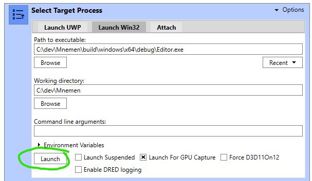
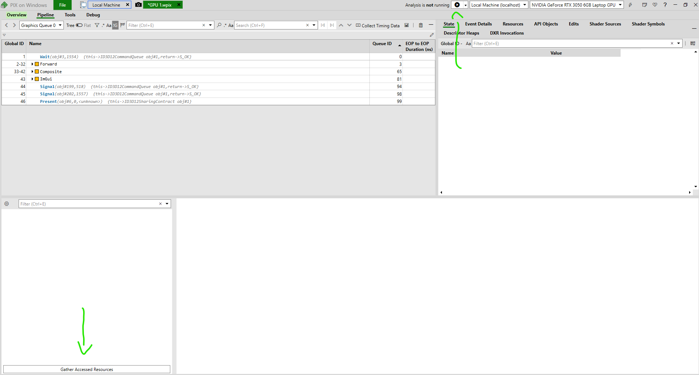
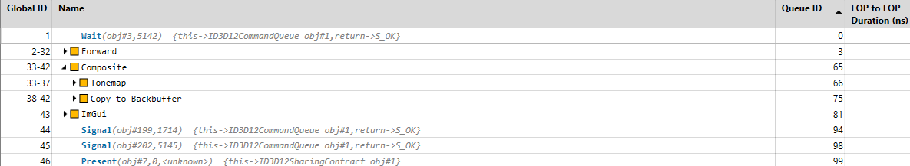
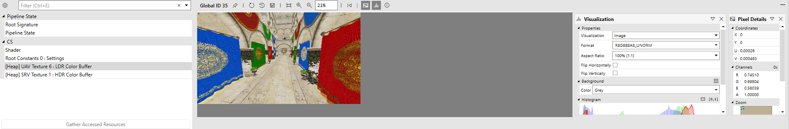
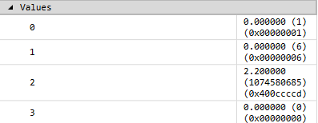

# Noobie Guide to PIX - Amélie Heinrich  

*Disclaimer: This guide is intended for FX programmers working on the **Mnemen engine**. Read at your own discretion >.>*

---

## What is PIX?  

[PIX](https://devblogs.microsoft.com/pix/) is a powerful performance tuning and debugging tool for Windows and Xbox game developers using DirectX 12. It provides three main modes of operation:  

- **GPU Captures** – Debug and analyze the performance of Direct3D 12 rendering, allowing you to inspect draw calls, shaders, and resource usage.  
- **Timing Captures** – Analyze CPU and GPU workloads, visualize frame timings, and identify performance bottlenecks.  
- **System Monitor** – Track real-time hardware counter data while the game is running, useful for profiling memory, CPU, and GPU usage.  

## How to Debug a Compute Shader Using PIX  

### Taking a GPU Capture  

To capture a frame for analysis:  

1. **Press `F11`** while running the application to take a GPU capture.  
2. Exit the application.  
3. In PIX, click on the captured frame to open it.  

  

Once the capture is loaded, make sure to:  

- **Press the Play button** next to "Analysis" to begin playback.  
- **Click "Gather Accessed Resources"** to view all the resources used in the capture.  

  

### Analyzing the Capture  

After loading the capture, you should see the **timeline view**. This provides a reconstruction of all major events within the **command buffer**, showing when and how resources were used.  

  

For this guide, we’ll analyze the **Composite/Tonemap pass**.  

### Inspecting a Compute Shader  

1. Click on the **Dispatch** call in the timeline.  
2. The **bottom panel** will display detailed information about:  
   - **Pipeline state**  
   - **Shaders in use**  
   - **Accessed resources**  

  

#### The Compute Shader (CS) Tab  

The **CS (Compute Shader) tab** is particularly useful for debugging:  

- View the shader source code and step through execution.  
- Inspect **root constants**, showing push constants in **float, int, and hex formats**.  
- Visualize bound **resources** and see how they are used by the shader.  

  

### Checking Root Constants  

In this example, our **push constants** are:  

```cpp
struct TonemapperSettings
{
    uint InputIndex;
    uint OutputIndex;
    float Gamma;
    uint Pad;
};
```
PIX correctly displays these values, helping us verify that the shader received the intended data.

### Visualizing Resources

Clicking on **any resource** will show its contents *after* the pass was executed. This is useful for debugging textures, buffers, and UAVs.

### Conclusion

With this workflow, you now have the tools needed to debug post-processing passes using PIX. Whether you're investigating incorrect output, performance issues, or missing data, PIX provides all the insights you need.
**Happy coding!**
