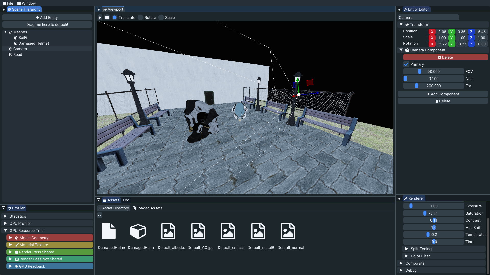

# MNEMEN ALPHA

## ENGINE FEATURES

### Core Features:
- **Windowing + Input:** Supports both keyboard and mouse input.
- **Complete ECS (Entity Component System):** Flexible, fast, and with support for hierarchies.
- **Backend DX12:** Utilizes DirectX 12 with mesh shaders, bindless resources, ray tracing, and compute support.
- **Asset Manager:** Automatic recycling, reuse, and cleanup of assets.
- **Asset Cacher:** Pre-caching of assets for faster load times. Supports DXIL for shaders and BC7 for textures.
  
### Rendering:
- **Simple Renderer:** 
  - Deferred shading.
  - HDR rendering.
  - Color grading.
  - Debug rendering.

### Scripting & Scene Management:
- **Start Scripting:** Ability to write basic Wren scripts without manipulating entities.
- **Scene Serialization/Deserialization:** Save and load scenes using `.json` format, renamed as `.msf` (Mnemen Scene File).
  
### Profiling:
- **Profiler:** In-depth profiling of CPU performance and tagging of resources.

---

## EDITOR FEATURES

### User Interface:
- **Viewport Panel UI:** Displays the renderer output, along with play, stop, and gizmo buttons for scene interaction.
- **Gizmos:** Manipulate entity transforms (Translate, Rotate, Scale).
- **Entity Editor UI:** Add, remove, and edit components on entities.
- **Renderer Settings UI:** Modify rendering settings (color correction, composite settings).
- **Profiler UI:** Real-time engine statistics (RAM, VRAM, battery usage, GPU resources, and CPU timers).
- **Log UI:** View log output with customizable filters.
- **Asset Manager UI:** Displays loaded assets with reference counts.

### Asset Management:
- **Asset Browser UI:** Simple directory browser to navigate your project's asset folder.
- **Full Drag & Drop Support:** 
  - Drag & drop scenes into the viewport to load them.
  - Drag & drop assets into components to load them easily.

### Usability:
- **Menu Bar UI:** Access a wide range of useful commands.
- **Shortcuts:** Customizable keyboard shortcuts for executing commands.
- **Theme Options:** Choose from 4 available themes – Mnemen, ImGui Dark, ImGui Light, and ImGui Classic.
- **Automatic Saving:** Your work is saved automatically to prevent data loss.
- **Open/Save Dialogs:** Easily open and save assets and scenes.

### Debugging:
- **Debug UI:** Renders camera frustum planes when an entity has a camera attached.
