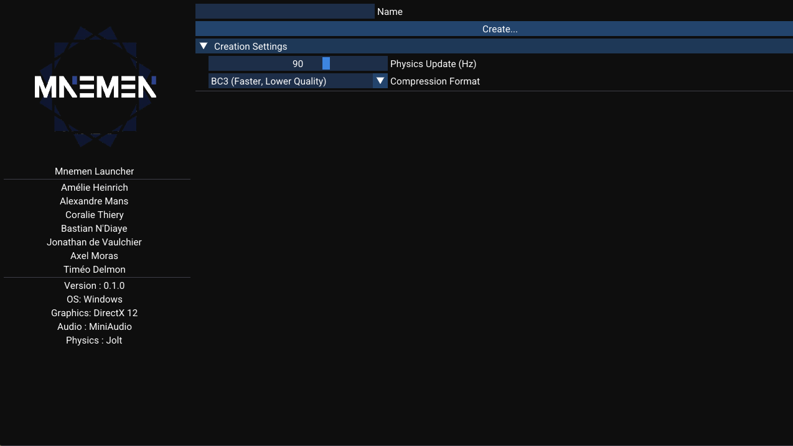

# MNEMEN BETA

## Overview
Mnemen Beta is an advanced game engine featuring cutting-edge rendering techniques, an intuitive project system, and experimental Lua scripting capabilities. This release introduces significant improvements to graphics, audio, and workflow efficiency.

## What's New
- **Lua Scripting (Experimental)** – Integrated via Sol3, enabling script-based customization.
- **Depth of Field** – Enhanced rendering with realistic focus effects.
- **Audio System** – Supports `.mp3`, `.ogg`, and `.wav` formats.
- **Scene Rollback** – Proper rollback when stopping the scene in the editor.
- **Post Process Volume** – New asset for applying post-processing effects to cameras.
- **File Creation Menu** – Added to the asset browser for streamlined project management.
- **Mnemen Window Icon** – Custom icon for better visual identity.
- **Project System** – Fully functional project management system.
- **Compressor Upgrade** – Now supports BC3 and BC7 texture compression formats.
- **Project Launcher** – Create and open projects seamlessly.

## Upcoming Features
The next release will focus on rendering, performance improvements, and quality of life features.
- **Bug Fixes** – Addressing known issues for better stability.
- **Hot-Reloading** – Dynamic reloading of shaders and scripts.
- **Scene Management** – Ability to change scenes within scripts.
- **Material Component** – Introduces material properties for better rendering.
- **Default Entities** – Built-in primitives (Cube, Capsule, Sphere, etc.).
- **Normal Maps** – Support for normal mapping in materials.
- **Physically Based Rendering (PBR)** – Enhanced material realism.
- **Shadow Mapping** – Directional and spot light shadows.
- **Optimized Rendering** – Frustum and cone culling for meshlets.
- **Anti-Aliasing** – Temporal Anti-Aliasing (TAA) and Fast Approximate Anti-Aliasing (FXAA).
- **Bloom Effect** – High-quality post-processing bloom.
- **Multithreading** – Improved engine performance through parallel processing.

## Future Considerations
Potential features for upcoming versions:
- **Animations** – Improved skeletal and keyframe animation support.
- **Raytraced Soft Shadows** – Realistic shadow rendering.
- **Draw Indirect** – Optimized rendering workflow.
- **Light Culling** – Efficient light management in scenes.
- **DirectStorage** – Faster asset loading.
- **Ocean Simulation** – Advanced water rendering using the Sum of Sines approach.
- **GPU Particles** – High-performance particle systems.

Stay tuned for updates as we continue refining Mnemen 1.0!